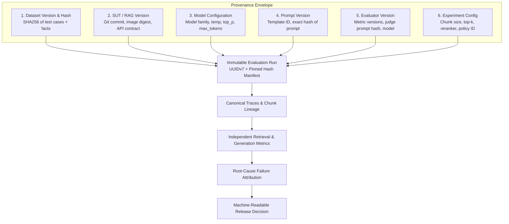
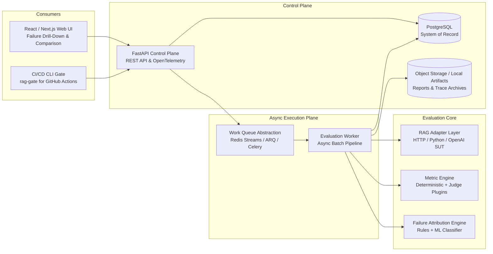
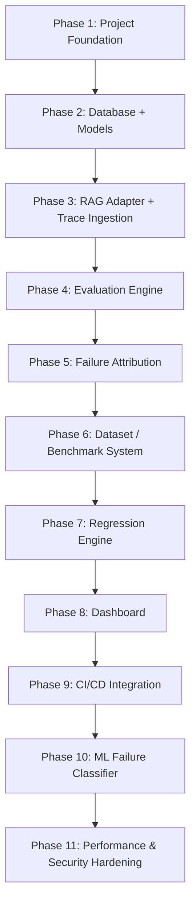

# RAG Reliability & Hallucination Testing Platform
## Master System Architecture & 11-Phase Implementation Plan

> **Core Design Principle:**  
> *Do not build another RAG chatbot. Build the quality, reliability, diagnosis, and regression layer around RAG systems so teams can prove that a RAG change improved or degraded production behavior.*

---

## 1. Architectural Contract & Provenance Matrix

The system design acts as the **immutable architecture contract**. The platform treats any RAG system under test (SUT) as an external system behind an explicit adapter interface.

### 1.1 The Six-Dimension Reproducibility Guarantee

To guarantee that any evaluation result is reproducible and audit-proof, every evaluation run is permanently anchored across six explicit dimensions:



| Dimension | Pinned Identifier | Verification Mechanism | Immutability Rule |
| :--- | :--- | :--- | :--- |
| **1. Dataset** | `dataset_id`, `version`, `checksum` | SHA256 over canonical JSON of cases | Modifying test cases creates a new draft version; published versions are frozen. |
| **2. RAG System** | `system_version` | Git commit hash / semver / Docker digest | Recorded in run metadata; validated against adapter handshake. |
| **3. Model Config** | `model_config_hash` | Hash of `{model, provider, temperature, top_p, seed}` | Exact inference parameters captured per trace. |
| **4. Prompt Version** | `prompt_version_id`, `prompt_hash` | SHA256 of the prompt template string | Pinned in trace metadata for both SUT and LLM judges. |
| **5. Evaluator** | `evaluator_version`, `judge_config_hash` | Semantic version of evaluator module + judge prompt hash | Ensures scoring changes cannot be confused with RAG regressions. |
| **6. Experiment** | `policy_id`, `run_options_hash` | Hash of `{top_k, reranker, thresholds, sampling}` | Run parameters cannot be altered once `QUEUED`. |

---

## 2. High-Level System Architecture & Component Decoupling

The platform is organized as a **modular monolith** with clean architectural boundaries. Operational components (queues, databases, storage) can be swapped or scaled horizontally without altering domain contracts.



### 2.1 Senior Dev (Ponytail) Architectural Improvements

We strip away premature distributed system complexity while keeping the architectural contract 100% intact:

1. **Single Python Package (`src/rag_platform`) over Monorepo Sprawl:**
   - *Why:* 10 separate `pyproject.toml` packages create packaging boilerplate, editable install synchronization bugs, and import bloat.
   - *Fix:* One clean `src/rag_platform` package with cohesive modules (`models`, `adapters`, `metrics`, `attribution`, `datasets`, `regression`, `api`, `worker`). Clean imports, zero packaging overhead.
2. **Zero-Infra Development Engine (SQLite + `asyncio.Queue` / PostgreSQL + Redis):**
   - *Why:* Requiring Docker + Redis + PostgreSQL just to run unit tests or evaluate a 10-query benchmark slows iteration to a crawl.
   - *Fix:* Native SQLAlchemy 2.0 async engine supporting both SQLite (`sqlite+aiosqlite:///` or SQLite sync for lightning-fast tests) and PostgreSQL (`postgresql+asyncpg://` for production). Work queue uses an abstract `JobQueue` protocol with an in-memory `asyncio.Queue` for local runs and Redis Streams for distributed workers.
3. **Cryptographic Run Manifest (`run_manifest_hash`):**
   - *Why:* Proving reproducibility across 6 independent dimensions must be mathematically verifiable, not just a promise in documentation.
   - *Fix:* Generate a deterministic SHA256 `run_manifest_hash` computed over the canonical sorted JSON of `{dataset_hash, rag_version, model_config_hash, prompt_hash, evaluator_version, experiment_hash}`. Stored on the Run record and stamped on every evaluation artifact.
4. **Built-in Mock RAGs for Deterministic Self-Testing:**
   - *Why:* LLMs cost money and introduce non-determinism during development.
   - *Fix:* Built-in synthetic RAG fixtures (`FlawedRagFixture`) that produce deterministic outputs for all 11 failure types (`RET-01` to `OPS-01`). Tests run 100% offline in milliseconds.

---

## 3. The 11-Phase Implementation Roadmap

The project is structured into 11 distinct, test-driven phases. Each phase establishes clean contracts, full unit/integration test coverage, and verifiable exit criteria.



---

### Phase 1: Project Foundation

**Objective:** Establish the clean monorepo architecture, foundational domain types, configuration system, structured logging, deterministic hashing, and self-testing infrastructure.

#### Key Architectural Deliverables
1. **Repository Layout:**
   ```text
   reliab/
   ├── packages/
   │   ├── common/           # Config, logging, UUIDv7, deterministic hashing, errors
   │   ├── domain/           # Pure Pydantic v2 entities, enums, reproducibility schemas
   │   ├── adapters/         # RAG adapter protocols & client implementations
   │   ├── evaluation/       # Metric engine, plugin interfaces, judges, cache
   │   ├── attribution/      # Diagnostic rules, taxonomy, citation/abstention checkers
   │   ├── datasets/         # Benchmark management, loaders, checksum verifiers
   │   ├── regression/       # Baseline comparison, delta calculations, policy engine
   │   └── ml/               # Feature extractors, training pipelines, XGBoost inference
   ├── apps/
   │   ├── api/              # FastAPI control plane, dependency injection, routes
   │   ├── worker/           # Async job runner, orchestration, concurrency controls
   │   └── web/              # React / Next.js web application
   ├── benchmarks/           # Locked, dev, and adversarial datasets
   └── tests/                # Unit, integration, contract, and self-testing suites
   ```
2. **Domain Core Entities & Enums:**
   - Enums: `RunStatus` (`CREATED`, `QUEUED`, `RUNNING`, `SCORING`, `ATTRIBUTING`, `COMPLETED`, `FAILED`, `CANCELLED`), `FailureCode` (`RET-01` to `OPS-01`), `Answerability` (`ANSWERABLE`, `UNANSWERABLE`).
   - Pure Domain Schemas: `TestCase`, `RetrievedChunk`, `Citation`, `RagTrace`, `MetricResult`, `FailureRecord`, `RunConfig`, `ReleasePolicy`.
3. **Reproducibility Utilities:**
   - Canonical JSON serializer and SHA256 checksum calculator to ensure bitwise reproducibility of dataset versions, prompt templates, and run manifests.
4. **Configuration & Observability:**
   - `pydantic-settings` based settings management reading `.env` with strict validation.
   - Structured JSON logging with `run_id`, `trace_id`, and `project_id` context propagation.

#### Verification & Exit Criteria
- Complete test suite running in `pytest` verifying domain models, serialization, and deterministic hashing.
- 100% type annotations with zero schema ambiguity.

---

### Phase 2: Database + Models

**Objective:** Build the relational system of record in PostgreSQL with SQLAlchemy 2.0, Alembic migrations, CRUD repositories, and immutability constraints.

#### Key Architectural Deliverables
1. **Relational Data Model:**
   - `projects`: Tenant/project boundary, configuration presets.
   - `datasets`: Versioned benchmarks (`version`, `status` [DRAFT, PUBLISHED, ARCHIVED], `checksum_sha256`).
   - `test_cases`: Golden cases belonging to a dataset version (`question`, `expected_answer`, `expected_facts`, `relevant_document_ids`, `answerability`, `tags`).
   - `runs`: Immutable evaluation runs (`project_id`, `dataset_id`, `system_version`, `prompt_version_id`, `evaluator_version`, `status`, `policy_id`, `provenance_manifest`).
   - `traces`: Captured execution summaries (`run_id`, `test_case_id`, `answer`, `model`, `latency_ms`, `input_tokens`, `output_tokens`, `cost`, `telemetry_json`).
   - `retrieved_chunks`: Granular chunk provenance (`trace_id`, `document_id`, `chunk_id`, `rank`, `score`, `text_ref`).
   - `metric_results`: Atomic metric records (`trace_id`, `metric_name`, `score`, `reason`, `evaluator_version`, `cached`).
   - `failures`: Attributed failure diagnoses (`trace_id`, `failure_type`, `severity`, `confidence`, `evidence_json`, `human_override_json`).
   - `policies`: Configurable release criteria and regression budgets.
2. **Alembic Migrations:**
   - Automated migration scripts tracking schema changes cleanly.
3. **Repository Pattern:**
   - Async repository classes (`ProjectRepo`, `DatasetRepo`, `RunRepo`, `TraceRepo`) abstracting database operations and enforcing transaction boundaries and immutability rules (e.g. attempting to update a completed `Run` raises an error).

#### Verification & Exit Criteria
- Integration test suite running migrations up and down against a live database.
- Repository tests verifying immutable run guarantees and query performance.

---

### Phase 3: RAG Adapter + Trace Ingestion

**Objective:** Build the SUT adapter abstraction layer, support HTTP, Python-callable, and OpenAI-compatible endpoints, implement canonical trace normalization, and develop deliberately flawed mock RAGs for platform self-testing.

#### Key Architectural Deliverables
1. **`RagAdapter` Interface:**
   ```python
   class RagAdapter(Protocol):
       async def run(self, case: TestCase, config: RunConfig) -> RagTrace:
           """Executes query against SUT and returns canonical trace."""
           ...
   ```
2. **Standard Adapters:**
   - `HttpRagAdapter`: Calls REST endpoint with configurable headers, payload mapping, timeout, exponential backoff, and circuit breaker.
   - `PythonRagAdapter`: Directly invokes in-process Python callable (for zero-latency development and local testing).
   - `OpenAiRagAdapter`: Integrates with OpenAI-compatible chat completion endpoints and tool/function retrieval calls.
3. **Trace Normalizer:**
   - Validates that returned payloads conform to `RagTrace`.
   - Handles partial availability: if SUT does not return chunks, flags `retrieval_available=False` rather than silently fabricating mock chunks.
4. **Flawed RAG Suite (Platform Self-Test Suite):**
   - `PerfectRAG`: Always retrieves correct chunks, accurately answers, provides valid citations.
   - `DistractorRetrieverRAG`: Retrieves irrelevant chunks (triggers `RET-01` / `RET-02`).
   - `HallucinatingGeneratorRAG`: Retrieves correct chunks but generates fabricated claims (triggers `GEN-01` / `GEN-02`).
   - `BrokenCitationRAG`: Generates correct answer but attaches false citation IDs (triggers `CIT-01`).
   - `RefusalBypassingRAG`: Answers unanswerable questions instead of refusing (triggers `ABS-01`).
   - `TimeoutFailingRAG`: Simulates external network crash / 504 timeout (triggers `OPS-01`, verifying that infra errors are never mislabeled as hallucinations).

#### Verification & Exit Criteria
- Contract tests verifying all adapters produce identical canonical trace formats.
- Self-test verifying flawed adapters trigger their expected error behaviors.

---

### Phase 4: Evaluation Engine

**Objective:** Build the plugin-based evaluation engine separating retrieval and generation scoring, implement deterministic and LLM/NLI judge metrics, and implement hashing-based evaluation caching.

#### Key Architectural Deliverables
1. **Metric Plugin Interface:**
   ```python
   class BaseMetric(ABC):
       name: str
       version: str
       metric_family: MetricFamily  # RETRIEVAL | GENERATION | CITATION | ABSTENTION
       
       @abstractmethod
       async def compute(self, trace: RagTrace, case: TestCase, context: EvalContext) -> MetricResult:
           ...
   ```
2. **Retrieval Metrics Suite:**
   - `Recall@K`: Binary check whether required golden documents/chunks appear in top-K.
   - `MRR` (Mean Reciprocal Rank) & `NDCG`: Position-aware ranking evaluation.
   - `Contextual Recall`: Measure of whether retrieved context contains the necessary facts.
   - `Contextual Precision`: Measure of whether relevant chunks are ranked above distractors.
   - `Contextual Relevancy`: Lexical/semantic signal-to-noise ratio of retrieved chunks.
3. **Generation Metrics Suite:**
   - `Faithfulness / Groundedness`: Extracts atomic claims from answer; verifies each claim is entailed by retrieved chunks.
   - `Answer Correctness`: Semantic & factual alignment with expected golden answer.
   - `Answer Relevancy`: Semantic alignment of answer to the original user question.
4. **Evaluator Cache & Run Budgeting:**
   - Evaluator cache keyed by `hash(case_input + trace_output + evaluator_version + prompt_hash)`.
   - Budget constraints: `max_cases`, `timeout_seconds`, `max_cost_usd`.

#### Verification & Exit Criteria
- Unit tests verifying exact mathematical calculation of Recall@K, MRR, NDCG on synthetic rankings.
- Metric unit tests verifying faithfulness scoring on entailed vs contradicting passages.
- Evaluator cache tests verifying identical inputs bypass re-computation.

---

### Phase 5: Failure Attribution

**Objective:** Implement the root-cause diagnosis engine (Taxonomy `RET-01` to `OPS-01`), claim-level citation validation, machine-checkable abstention verification, and evidence report packaging.

#### Key Architectural Deliverables
1. **Taxonomy & Diagnostic Pipeline:**
   ```mermaid
   graph TD
       T[Canonical Trace + Metric Results] --> STEP1{1. Infra Error?}
       STEP1 -- Yes --> OPS01[OPS-01: Infrastructure Timeout/Error]
       STEP1 -- No --> STEP2{2. Corpus Has Evidence?}
       STEP2 -- No --> STEP2A{SUT Abstained?}
       STEP2A -- Yes --> PASS_ABS[Valid Abstention]
       STEP2A -- No --> ABS01[ABS-01: Abstention Failure / Hallucination]
       STEP2 -- Yes --> STEP3{3. Evidence Retrieved?}
       STEP3 -- No --> RET01[RET-01: Retrieval Miss]
       STEP3 -- Yes --> STEP4{4. Evidence Ranked High?}
       STEP4 -- No --> RET02[RET-02: Bad Ranking]
       STEP4 -- Yes --> STEP5{5. Claims Entailed?}
       STEP5 -- Contradicts --> GEN02[GEN-02: Contradiction]
       STEP5 -- Unsupported --> GEN01[GEN-01: Unsupported Claim]
       STEP5 -- Entailed --> STEP6{6. Citations Match?}
       STEP6 -- False Ref --> CIT01[CIT-01: Mis-citation]
       STEP6 -- Missing Ref --> CIT02[CIT-02: Missing Citation]
       STEP6 -- All Good --> SUCCESS[Quality Pass]
   ```
2. **Citation Validator:**
   - Claim extraction parses answer into atomic propositions.
   - Verifies whether each cited `chunk_id` / span actually supports the claim.
3. **Abstention Evaluator:**
   - For cases tagged `UNANSWERABLE`, validates whether the system correctly refused:
     `abstained=True`, `reason_code=INSUFFICIENT_EVIDENCE`.
4. **Attribution Evidence Artifact:**
   - Generates structured failure reports with question, expected facts, retrieved evidence, claim breakdown, and recommended remediation experiments.
5. **Human Override Contract:**
   - Schema and API for reviewer feedback: captures corrected label, reviewer notes, and timestamp for downstream ML training.

#### Verification & Exit Criteria
- Complete test suite evaluating all 6 flawed test RAG adapters; each adapter must be classified with the exact expected `FailureCode` at ≥0.90 confidence.
- Zero false hallucination classifications on infrastructure errors.

---

### Phase 6: Dataset / Benchmark System

**Objective:** Build the benchmark management subsystem with immutable versioning, golden test cases, multi-format import/export (JSONL, CSV), and adversarial attack generator.

#### Key Architectural Deliverables
1. **Dataset Versioning Engine:**
   - Dataset states: `DRAFT` (mutable), `PUBLISHED` (immutable, locked with SHA256), `ARCHIVED`.
   - Checksum algorithm guarantees dataset integrity.
2. **Test Case Schema:**
   - Fields: `question`, `expected_answer`, `expected_facts` (list of strings), `relevant_documents` (`document_id`, `chunk_id`, `span`), `answerability` (`ANSWERABLE` / `UNANSWERABLE`), `tags`, `difficulty`.
3. **Import / Export Subsystem:**
   - JSONL and CSV parsers with schema validation and error reporting.
4. **Adversarial Benchmark Generator:**
   - Synthesizes edge cases preserving provenance to source documents:
     - `Unanswerable`: Questions asking for missing facts.
     - `Distractor`: Injecting semantically close but irrelevant passages.
     - `Conflict`: Documents with contradictory statements and differing dates.
     - `Citation Trap`: Swapping chunk pointers to test citation accuracy.

#### Verification & Exit Criteria
- Checksum verification preventing any modification to published datasets.
- Round-trip import/export test confirming bitwise parity of dataset definitions.
- Adversarial generation test producing structured test suites with answerability labels.

---

### Phase 7: Regression Engine

**Objective:** Build the run comparison engine, baseline management, metric delta calculators, release policy evaluation, and machine-readable gate decisions.

#### Key Architectural Deliverables
1. **Baseline & Run Comparator:**
   - Compares candidate `run_id` against baseline `run_id`.
   - Computes absolute delta ($\Delta = C - B$) and relative delta ($\Delta\% = \frac{C - B}{B} \times 100$).
   - Flags regressions per test case: identifies cases that passed in baseline but failed in candidate.
2. **Release Policy Engine:**
   - Evaluates composite criteria:
     ```python
     ReleasePolicy(
         min_faithfulness=0.90,
         min_retrieval_recall=0.92,
         min_citation_accuracy=0.95,
         max_hallucination_rate=0.05,
         min_abstention_accuracy=0.90,
         max_latency_regression_pct=20.0,
         max_cost_regression_pct=25.0,
         max_critical_regressions=0,
     )
     ```
3. **Gate Result Schema:**
   - Outputs machine-readable JSON: `status` (`PASS` / `FAIL`), `violations`, `critical_regressions`, `report_summary`.

#### Verification & Exit Criteria
- Regression engine test proving that an intentional degradation in retrieval recall or faithfulness immediately triggers a `FAIL` gate status with detailed violations.
- Gate evaluation executes in < 100ms over stored run metrics.

---

### Phase 8: Dashboard

**Objective:** Build the developer-facing Web UI and REST APIs for project setup, dataset curation, run monitoring, failure drill-down, and baseline comparison.

#### Key Architectural Deliverables
1. **Backend REST APIs:**
   - `/v1/projects`: Create and configure projects and adapters.
   - `/v1/datasets`: Versioned benchmark management, test case explorer.
   - `/v1/runs`: Run creation, execution progress, real-time status.
   - `/v1/runs/{id}/traces`: Paged trace explorer with filtering by failure code.
   - `/v1/runs/{id}/failures`: Failure attribution drill-down with human review overrides.
   - `/v1/compare`: Side-by-side run regression comparison.
2. **Frontend UI Modules:**
   - **Executive Run Overview:** Key metrics radar, pass/fail badge, latency and cost distributions.
   - **Failure Inspector (Drill-Down):** Split view showing Question $\rightarrow$ Retrieved Chunks (with relevance scores) $\rightarrow$ Answer $\rightarrow$ Claim-level citations $\rightarrow$ Root-cause diagnosis.
   - **Run Comparison / Diff View:** Side-by-side comparison of baseline vs candidate runs highlighting specific regressed test cases.
   - **Benchmark Editor:** Dataset manager with tag filters and import/export capabilities.

#### Verification & Exit Criteria
- Interactive web interface rendering run metrics, traces, and comparisons.
- End-to-end API tests for all frontend endpoints.

---

### Phase 9: CI/CD Integration

**Objective:** Build the headless CI quality gate CLI (`rag-gate`), GitHub Actions workflows, machine-readable JUnit XML / JSON reports, and fail-closed security logic.

#### Key Architectural Deliverables
1. **CLI Tool (`rag-gate`):**
   - Headless Python CLI executable via `python -m rag_platform.cli.gate` or console script:
     ```bash
     rag-gate --project proj_123 --dataset benchmark@v2 --system-version $GITHUB_SHA --suite smoke --policy prod-default
     ```
   - Polls run status, outputs live terminal progress, writes JUnit XML report for test dashboards, and exits with code `0` (PASS) or `1` (FAIL).
2. **GitHub Actions Workflow Integration:**
   - Ready-to-use `.github/workflows/rag-evaluation.yml` for pull requests (smoke suite) and main branch merges (regression suite).
3. **Fail-Closed Policy:**
   - If the evaluator itself crashes or network times out, the gate exits with non-zero status unless explicitly overridden by policy.

#### Verification & Exit Criteria
- Automated test simulating a CI run against a passing SUT (returns exit code 0) and a failing SUT (returns exit code 1 with JUnit XML violation summary).

---

### Phase 10: ML Failure Classifier

**Objective:** Train an explainable machine learning classifier (XGBoost) downstream of the metric engine to predict root cause, evaluate with calibration and Macro F1, and establish an active learning review queue.

#### Key Architectural Deliverables
1. **Feature Engineering Pipeline:**
   - Extract structured features from canonical trace + metric outputs:
     - Question lexical length, query token count.
     - Top-K similarity scores, min score, max score, score delta (gap between rank 1 and rank 2).
     - Gold evidence rank, number of retrieved chunks.
     - Answer token count, extracted claim count, citation count.
     - Entailment and contradiction probabilities between claims and chunks.
     - Pre-computed metric outputs (contextual recall, precision, faithfulness).
2. **Model Architecture & Training:**
   - Multi-class **XGBoost** model predicting `RET-01`, `RET-02`, `GEN-01`, `GEN-02`, `CIT-01`, `ABS-01`.
   - Stratified train/val/test splits over historical and synthetic traces.
   - Probability calibration (Platt scaling / Isotonic regression) to ensure prediction confidence reflects actual diagnostic accuracy.
3. **Evaluation & Explainability:**
   - Evaluated on held-out locked benchmark: Macro F1, per-class precision/recall, Expected Calibration Error (ECE), and confusion matrix.
   - SHAP/Feature importance reporting to explain why a specific diagnosis was assigned.
4. **Active Learning Queue:**
   - Flags low-confidence predictions ($\text{confidence} < 0.70$) for human reviewer inspection to continuously enrich the training set.

#### Verification & Exit Criteria
- Model training pipeline runs reproducibly on synthetic/golden dataset.
- Macro F1 evaluated on held-out test split, comparing ML predictions against rule baseline.

---

### Phase 11: Performance & Security Hardening

**Objective:** Implement prompt injection sanitization in evaluator prompts, secret redaction middleware, rate limiting, concurrency quotas, tenant isolation, and audit logging.

#### Key Architectural Deliverables
1. **Prompt Injection & Evaluator Defense:**
   - Treat all retrieved documents and user answers as untrusted data.
   - Evaluator prompts use strict delimiter encapsulation (e.g. `<untrusted_retrieved_evidence>` tags) and explicit instructions preventing jailbreaks.
2. **Secret Redaction Middleware:**
   - Automatically sanitizes API keys, Bearer tokens, and secrets from all stored traces, logs, and error messages.
3. **Concurrency & Cost Quotas:**
   - Per-project concurrency limiters and monthly token/spend caps.
   - Exponential backoff and token-bucket rate limiters for external LLM judge calls.
4. **Tenant Isolation & Audit Trail:**
   - Strict `project_id` scoping across all database queries.
   - Immutable audit logging for policy modifications, baseline designations, and human label overrides.

#### Verification & Exit Criteria
- Security unit tests verifying malicious injection strings inside retrieved chunks cannot hijack evaluator scores.
- Secret redaction tests verifying authorization tokens are stripped from trace logs.

---

## 4. Canonical Data Contracts (Pydantic v2 Specifications)

Below are the foundational contracts that guarantee architectural decoupling and end-to-end type safety:

```python
from enum import Enum
from typing import Any, List, Optional, Dict
from pydantic import BaseModel, Field


class Answerability(str, Enum):
    ANSWERABLE = "ANSWERABLE"
    UNANSWERABLE = "UNANSWERABLE"


class FailureCode(str, Enum):
    RET_01 = "RET-01"  # Retrieval miss
    RET_02 = "RET-02"  # Bad ranking
    GEN_01 = "GEN-01"  # Unsupported claim / Hallucination
    GEN_02 = "GEN-02"  # Contradiction with retrieved context
    CIT_01 = "CIT-01"  # Mis-citation
    CIT_02 = "CIT-02"  # Missing citation
    KNW_01 = "KNW-01"  # Knowledge gap
    ABS_01 = "ABS-01"  # Abstention failure
    NUM_01 = "NUM-01"  # Numerical reasoning failure
    ENT_01 = "ENT-01"  # Entity confusion
    OPS_01 = "OPS-01"  # Infrastructure timeout / rate-limit


class TestCase(BaseModel):
    id: str
    question: str
    expected_answer: Optional[str] = None
    expected_facts: List[str] = Field(default_factory=list)
    relevant_document_ids: List[str] = Field(default_factory=list)
    answerability: Answerability = Answerability.ANSWERABLE
    tags: List[str] = Field(default_factory=list)
    metadata: Dict[str, Any] = Field(default_factory=dict)


class RetrievedChunk(BaseModel):
    document_id: str
    chunk_id: str
    rank: int
    score: float
    text: str
    metadata: Dict[str, Any] = Field(default_factory=dict)


class Citation(BaseModel):
    claim_id: str
    claim_text: str
    document_id: str
    chunk_id: str
    span: Optional[List[int]] = None


class RagTrace(BaseModel):
    trace_id: str
    run_id: str
    test_case_id: str
    question: str
    answer: Optional[str] = None
    abstained: bool = False
    abstention_reason: Optional[str] = None
    retrieval_available: bool = True
    retrieved_chunks: List[RetrievedChunk] = Field(default_factory=list)
    citations: List[Citation] = Field(default_factory=list)
    latency_ms: int = 0
    input_tokens: Optional[int] = None
    output_tokens: Optional[int] = None
    cost_usd: Optional[float] = None
    model: Optional[str] = None
    error_code: Optional[str] = None
    telemetry: Dict[str, Any] = Field(default_factory=dict)


class MetricResult(BaseModel):
    metric_name: str
    metric_family: str
    score: float
    reason: Optional[str] = None
    evaluator_version: str
    cached: bool = False
    metadata: Dict[str, Any] = Field(default_factory=dict)


class FailureAttribution(BaseModel):
    trace_id: str
    failure_type: FailureCode
    severity: str  # LOW | MEDIUM | HIGH | CRITICAL
    confidence: float  # Diagnostic certainty [0.0 - 1.0]
    explanation: str
    evidence: Dict[str, Any] = Field(default_factory=dict)
    recommended_actions: List[str] = Field(default_factory=list)
```

---

## 5. Execution Strategy & Next Steps

Each phase builds directly upon the previous phase, enforcing testability, correctness, and reproducible measurement.

1. **Phase 1 (Immediate Next Step):**
   - Initialize Python project structure and package namespaces.
   - Implement `packages/common` (config, logging, hashing, UUIDs).
   - Implement `packages/domain` (Pydantic models, enums, canonical schemas).
   - Write comprehensive unit tests for serialization, validation, and reproducible checksum hashing.
2. **Phase 2 (Subsequent Step):**
   - Setup SQLAlchemy 2.0 models and Alembic migrations.
   - Implement immutable database repositories and audit logging.
3. **Phases 3 to 11:**
   - Execute in strict sequence according to this plan.
