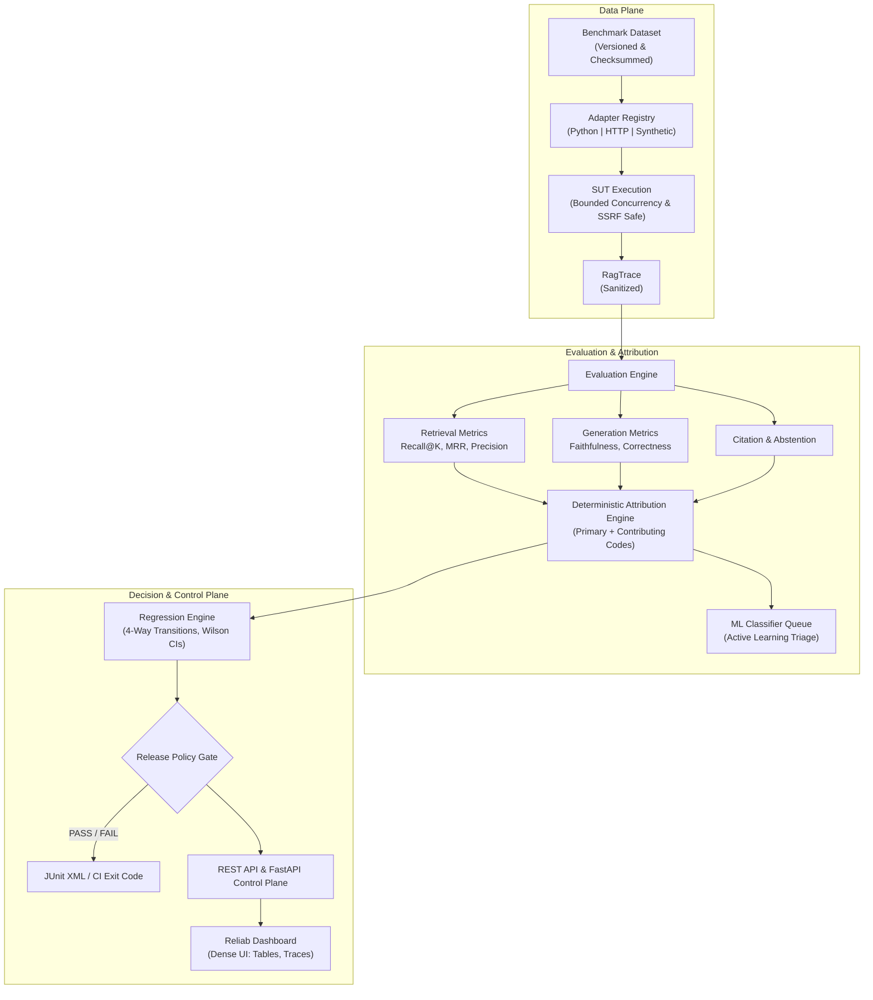

# Reliab

<p align="center">
  
</p>

<p align="center">
  <strong>Developer infrastructure for testing, failure diagnosis, regression gating, and reliability engineering in RAG &amp; LLM systems.</strong>
</p>

<p align="center">
  <a href="https://github.com/harsh-1o/reliab/actions/workflows/reliab-evaluation.yml"></a>
  <a href="https://www.python.org/"></a>
  <a href="https://fastapi.tiangolo.com"></a>
  <a href="https://docs.pydantic.dev/"></a>
  <a href="https://alembic.sqlalchemy.org/"></a>
  <a href="LICENSE"></a>
</p>

---

## 1. Overview

**Reliab** is developer infrastructure for continuous evaluation, automated failure attribution, regression detection, and release gating for Retrieval-Augmented Generation (RAG) and LLM-powered applications.

### The Problem
Retrieval-Augmented Generation systems fail in nuanced, compounding ways:
- **Retrieval Misses**: The retriever fails to pull the document containing the required factual answer.
- **Context Distraction**: Irrelevant or distractor chunks crowd out gold evidence in the LLM prompt.
- **Hallucinations & Extrapolations**: The model asserts unsupported claims despite correct evidence.
- **Contradictions**: The model outputs statements directly conflicting with retrieved evidence.
- **Citation Fabrications**: Citations reference chunks that do not substantiate the claim.
- **Silent Degradation**: Upstream changes to chunking, embeddings, or prompts degrade specific query clusters while aggregate averages mask regressions.

Traditional testing frameworks evaluate RAG with single-number heuristics (e.g. token F1) or ungrounded LLM judges. **Reliab** addresses these challenges by decomposing responses into atomic claims, decoupling retrieval from generation metrics, attributing failures to a canonical taxonomy with supporting evidence, tracking statistical confidence intervals, and gating pull requests in CI/CD.

---

## Table of Contents

1. [Overview](#1-overview)
2. [Platform Architecture](#2-platform-architecture)
3. [Evaluation Pipeline](#3-evaluation-pipeline)
4. [Supported Metrics & Metric Applicability](#4-supported-metrics--metric-applicability)
5. [Claim-Level Evaluation](#5-claim-level-evaluation)
6. [Retrieval Evaluation](#6-retrieval-evaluation)
7. [Citation Evaluation](#7-citation-evaluation)
8. [Abstention & Refusal Quality](#8-abstention--refusal-quality)
9. [Failure Taxonomy & Attribution](#9-failure-taxonomy--attribution)
10. [Regression Engine & Release Policies](#10-regression-engine--release-policies)
11. [Reproducible Run Manifests & Provenance](#11-reproducible-run-manifests--provenance)
12. [Security, Privacy & Trace Sanitization](#12-security-privacy--trace-sanitization)
13. [Adversarial & Robustness Benchmarking](#13-adversarial--robustness-benchmarking)
14. [REST API Reference](#14-rest-api-reference)
15. [Headless CI/CD CLI Gate](#15-headless-cicd-cli-gate)
16. [Web Engineering Dashboard](#16-web-engineering-dashboard)
17. [Local Setup & Development](#17-local-setup--development)
18. [CI/CD Integration](#18-cicd-integration)
19. [Known Limitations](#19-known-limitations)
20. [Engineering Roadmap](#20-engineering-roadmap)

---

## 2. Platform Architecture

Reliab separates the control plane, execution adapters, metric evaluators, regression engines, and presentation layers:



### Key Architectural Tenets
- **Deterministic Rules as Source of Truth**: Failure attribution is driven by an explainable, deterministic rule engine. The machine learning classifier acts strictly as an auxiliary prioritization signal.
- **Fail-Closed Release Gates**: Pull requests and deployments are blocked if quality falls below configured statistical or cost thresholds.
- **Decoupled Metric Applicability**: Metrics explicitly report `NOT_APPLICABLE` when prerequisite evidence is absent, preventing distortion of aggregate scores.
- **Recursive Sanitization Before Storage**: Traces are recursively stripped of secrets, credentials, and API keys prior to database persistence.
- **Socket-Level SSRF Protection**: HTTP adapters enforce pre-flight IP validation and DNS socket-pinning to prevent DNS rebinding attacks against private networks.

---

## 3. Evaluation Pipeline

For each test case evaluated against an active RAG system:

```text
Test Case + Run Configuration
       ↓
  RAG Adapter Execution (Async / Semaphore Concurrency & SSRF Transport)
       ↓
  Recursive Secret Sanitization
       ↓
  Metric Evaluation (Parallel Async Tasks)
   ├── Retrieval Evaluation (Recall@K, MRR, Contextual Precision)
   ├── Claim Extraction & Decomposition
   ├── Lexical Claim Grounding & Verification
   ├── Fact-Anchored Answer Correctness
   ├── Citation Validation
   └── Abstention & Refusal Verification
       ↓
  Failure Attribution (Primary code, Contributing codes, Evidence)
       ↓
  Database Persistence (Alembic schema, Normalized records)
       ↓
  Aggregate Run Metrics (Wilson Score Intervals, Bootstrap, Sample Warnings)
```

---

## 4. Supported Metrics & Metric Applicability

Reliab defines three families of metrics. Crucially, **precondition failures emit `NOT_APPLICABLE` (`score=None`)** rather than artificial default scores:

| Metric Name | Family | Applicable Condition | Failure Definition | Precondition Absent Behavior |
|:---|:---|:---|:---|:---|
| `recall_at_k` | Retrieval | Gold evidence supplied | Gold documents not found in top-K | `status=NOT_APPLICABLE`, `score=None` |
| `mrr` | Retrieval | Gold evidence supplied | Gold document rank > threshold | `status=NOT_APPLICABLE`, `score=None` |
| `contextual_precision` | Retrieval | Gold evidence supplied | Relevant chunks ranked behind noise | `status=NOT_APPLICABLE`, `score=None` |
| `faithfulness` | Generation | Answerable, text produced | Unsupported or contradicted claims | `status=PASS`, `score=1.0` (if clean abstention) |
| `answer_correctness` | Generation | Expected facts supplied | Expected facts missing or contradicted | `status=NOT_APPLICABLE`, `score=None` |
| `citation_accuracy` | Citation | Factual claims generated | Claims cite wrong chunks or missing citations | `status=NOT_APPLICABLE`, `score=None` (if unanswerable) |
| `abstention_accuracy` | Abstention | Always evaluated | Unanswerable query answered, or answerable query refused | Scored on all test cases |

### Statistical Reporting
- **Wilson Score Interval**: Computed for all bounded binomial proportion metrics (e.g. Recall, Precision, Faithfulness) to prevent distorted confidence on small test suites.
- **Sample Size Warnings**: Runs with $N < 30$ cases automatically emit warnings in reports and UI:
  `Small sample size (N < 30); statistical variance is elevated.`

---

## 5. Claim-Level Evaluation

Rather than relying on ungrounded token overlap or opaque LLM judges, Reliab implements **Lexical Claim Grounding**:

```text
Generated Answer
       ↓
Sentence & Clause Decomposition
       ↓
Atomic Proposition Units
       ↓
Equivalence Normalization ("one month" ↔ "30 days")
       ↓
Evidence Chunk Alignment
       ↓
[SUPPORTED] | [UNSUPPORTED] | [CONTRADICTED]
```

### Clause Decomposition
Handles complex compound statements with coordinating conjunctions (`and`, `but`, `while`), semicolons, and numbers.
- **Input**: `"Revenue increased 20% and profit increased 15%."`
- **Output**:
  - `Claim 1`: `"Revenue increased 20%."` (Supported by evidence)
  - `Claim 2`: `"Profit increased 15%."` (Unsupported if evidence only mentions revenue)
  - **Verdict**: Faithfulness = 0.50, `status=FAIL`.

### Contradiction Detection
Detects opposing predicates and conflicting numerical metrics:
- **Numerical Conflicts**: Evidence states `"Revenue was $80M."`, Answer asserts `"Revenue was $100M."` $\to$ `CONTRADICTED`.
- **Antonym Pairs**: `"increased"` vs `"decreased"`, `"approved"` vs `"rejected"`, `"allowed"` vs `"prohibited"`.

---

## 6. Retrieval Evaluation

Retrieval evaluators benchmark the quality of the retriever subsystem against known golden documents:

- **Recall@K**: Proportion of golden document references successfully retrieved within the top-$K$ ranks.
- **Mean Reciprocal Rank (MRR)**: Evaluates the rank position of the first relevant chunk:
  $$\text{MRR} = \frac{1}{\text{rank}_{\text{first}}}$$
- **Contextual Precision**: Measures whether relevant chunks are concentrated at top ranks versus diluted by irrelevant chunks.

---

## 7. Citation Evaluation

Citations must be claim-aware, verifying that citations reference chunks that actually substantiate the claim:

- **Claim-Citation Alignment**: Matches the cited `document_id` and `chunk_id` to retrieved chunks.
- **Grounded Verification**: Verifies whether the cited chunk contains lexical or semantic evidence for the cited statement.
- **Missing Citation Penalties**: If factual statements are generated on answerable queries with zero citations, `citation_accuracy = 0.0` (`FAIL`).
- **Unanswerable Abstentions**: If the system abstains or no factual statements are made, `citation_accuracy = NOT_APPLICABLE` (`score=None`).

---

## 8. Abstention & Refusal Quality

Reliab explicitly tests whether the system knows what it does *not* know:
- **Unanswerable Benchmark Cases**: Questions designed with zero relevant documents or adversarial unanswerable prompts.
- **Refusal Verification**: Scored via `abstention_accuracy`.
  - Case unanswerable and system abstains: **Pass (1.0)**.
  - Case unanswerable and system attempts to answer: **Fail (0.0, Code ABS-01)**.
  - Case answerable and system refuses to answer: **Fail (0.0, Code ABS-02)**.

---

## 9. Failure Taxonomy & Attribution

Every failed trace is diagnosed into primary and contributing codes following a canonical taxonomy:

| Code | Name | Family | Diagnostic Condition | Remediation Guidance |
|:---|:---|:---|:---|:---|
| **RET-01** | Empty Retrieval | Retrieval | Top chunk similarity < 0.35 or zero relevant chunks | Tune embedding model, check document indexing pipeline |
| **RET-02** | Low-Precision Retrieval | Retrieval | Recall < 0.60 or contextual precision < 0.40 | Add cross-encoder reranker, increase chunk overlap |
| **RET-03** | Distractor Overload | Retrieval | Top-ranked chunks are irrelevant noise | Implement dense-sparse hybrid search with reranking |
| **GEN-01** | Factual Hallucination | Generation | Faithfulness < 0.60 with supported retrieval | Constrain prompt, lower temperature, enforce citation grounding |
| **GEN-02** | Contradiction | Generation | Direct numerical or predicate conflict with evidence | Introduce verification self-correction step |
| **CIT-01** | Missing Citation | Citation | Claim generated without supporting document citations | Constrain citation output format with JSON schema |
| **CIT-02** | Unsubstantiated Citation | Citation | Cited chunk does not contain evidence for claim | Enforce citation alignment verification before answering |
| **ABS-01** | Over-Generation on Unanswerable | Abstention | System answered query marked UNANSWERABLE | Improve system refusal prompt and confidence thresholding |
| **ABS-02** | False Refusal | Abstention | System refused query with gold evidence present | Relax strict refusal heuristic in system prompt |
| **OPS-01** | Infrastructure Timeout / Error | Infrastructure | HTTP connection error, timeout, or 5xx provider status | Implement connection pooling and retry backoff |

---

## 10. Regression Engine & Release Policies

The regression engine compares candidate runs against baseline evaluations across three dimensions:

### 1. Metric Thresholds & Budgets
```python
policy = ReleasePolicy(
    min_faithfulness=0.90,
    min_retrieval_recall=0.85,
    min_citation_accuracy=0.90,
    max_hallucination_rate=0.05,
    max_latency_regression_pct=20.0,
    max_cost_regression_pct=25.0,
    min_cost_budget_usd=0.05,  # Prevents zero-baseline division errors
)
```

### 2. Four-Way Per-Case Transition Analysis
Rather than only comparing aggregate averages, the engine tracks case-level movement:
- **`NEW_FAILURE`**: Passed in baseline, now failing in candidate (critical release blocker).
- **`RECOVERED`**: Failed in baseline, now passing in candidate.
- **`UNCHANGED_PASS`**: Maintained quality standard.
- **`UNCHANGED_FAIL`**: Chronic technical debt requiring remediation.

---

## 11. Reproducible Run Manifests & Provenance

Every evaluation run records an immutable `RunProvenance` record containing:
- **`dataset_checksum`**: SHA-256 hash of all test cases in the dataset version.
- **`rag_version`**: Evaluated system version or Git commit SHA.
- **`adapter_config`**: Configuration payload stripped of API keys and credentials.
- **`dependency_lock_hash`**: SHA-256 hash of `requirements.lock` ensuring reproducible dependencies.
- **`environment_info`**: Python runtime, platform, and worker identifier.

---

## 12. Security, Privacy & Trace Sanitization

Reliab enforces multi-layered security controls:
- **Fail-Closed Authentication**: `AUTH_ENABLED=true` by default; rejects startup if `DEV_MODE=true` is used in staging/production environments.
- **Socket-Level SSRF Protection**: `SSRFProtectedTransport` enforces pre-flight IP validation against RFC1918 / RFC3927 private ranges and pins the socket connection IP, preventing DNS-rebinding attacks.
- **Recursive Secret Sanitization**: Redacts JWTs, bearer tokens, API keys, and connection strings from inputs, traces, attribution evidence, and run options before persistence.
- **Tenant Isolation**: Projects enforce role-based access control and strict project-dataset ownership verification.

---

## 13. Adversarial & Robustness Benchmarking

Reliab includes benchmark test cases covering stress scenarios:
- **Multi-Hop QA**: Answers requiring synthesis across multiple chunks.
- **Unanswerable Queries**: Security questions and out-of-domain prompts.
- **Adversarial Distractors**: Documents sharing entity keywords but describing unrelated events.
- **Prompt Injection Probes**: Attempts to hijack model instructions through retrieved text.

---

## 14. REST API Reference

| Method | Endpoint | Description |
|:---|:---|:---|
| `GET` | `/v1/health` | Service health status and timestamp |
| `POST` | `/v1/projects` | Register a new project workspace |
| `GET` | `/v1/projects` | List projects (with pagination `limit`, `offset`) |
| `POST` | `/v1/datasets` | Create draft benchmark dataset |
| `POST` | `/v1/datasets/{id}/publish` | Publish and lock benchmark dataset version |
| `POST` | `/v1/datasets/{id}/cases/bulk` | Bulk insert benchmark test cases |
| `POST` | `/v1/runs` | Launch evaluation run (`async_exec=true` returns `202 Accepted` + `QUEUED`) |
| `POST` | `/v1/runs/{id}/cancel` | Cancel an in-flight evaluation run |
| `GET` | `/v1/runs` | List evaluation runs with summary metrics |
| `GET` | `/v1/runs/{id}` | Fetch run details, provenance, and status |
| `GET` | `/v1/runs/{id}/traces` | List traces with metrics and failure attributions |
| `POST` | `/v1/compare` | Compare candidate run against baseline |
| `POST` | `/v1/maintenance/cleanup` | Purge expired runs based on retention policy |
| `GET` | `/dashboard` | Interactive engineering console |

### Authentication & Authorization
Set `RAG_AUTH_ENABLED=true` and `RAG_API_KEY=your-secret-key`. Include credentials in requests:
```bash
curl -H "X-API-Key: your-secret-key" http://localhost:8080/v1/runs
```

---

## 15. Headless CI/CD CLI Gate

Run headless quality evaluation in CI/CD pipelines with JUnit XML export:

```bash
# Direct module execution:
python -m rag_platform.gate \
  --bootstrap \
  --project proj_ci \
  --dataset ds_ci_benchmark \
  --system-version $(git rev-parse HEAD) \
  --policy prod-default \
  --junit-xml test-results/reliab-gate.xml

# Or via console script:
reliab-gate \
  --bootstrap \
  --project proj_ci \
  --dataset ds_ci_benchmark \
  --system-version $(git rev-parse HEAD) \
  --policy prod-default \
  --junit-xml test-results/reliab-gate.xml
```

- **Exit Code 0**: All thresholds and regression budgets satisfied (`PASS`).
- **Exit Code 1**: Quality gate violations detected (`FAIL`).
- **`--bootstrap`**: Automatically initializes database schema and seeds benchmark data on a clean runner.

---

## 16. Standalone Durable Worker

Execute queued asynchronous runs with distributed database-backed lease locking:

```bash
# Direct module execution:
python -m rag_platform.worker

# Or via console script:
reliab-worker
```

Features atomic lease claiming, heartbeat monitoring, and automatic stale runner recovery.

---

## 17. Web Engineering Dashboard

The Reliab console provides a dense, data-first observability view:
- **Key Metrics Table**: Faithfulness, Recall@5, MRR, Contextual Precision, Citation Accuracy, Abstention Accuracy, Latency, and Cost.
- **Trace Inspector**: Side-by-side view of Question, Retrieved Chunks, Answer, Extracted Claims, and Citations.
- **Root-Cause Attribution Badges**: Visual indicators of primary failure codes and remedial actions.
- **Responsive Layout**: Seamlessly transitions between full desktop wordmark and compact symbol mark on mobile/narrow displays.

---

## 18. Local Setup & Development

### 1. Prerequisites
- Python 3.11+
- Virtual environment tool (`venv`)

### 2. Setup
```bash
# Create virtual environment
python -m venv .venv
source .venv/bin/activate  # On Windows: .venv\Scripts\Activate.ps1

# Install in editable mode with development & ML extras
pip install -e ".[ml]" pytest pytest-asyncio pytest-cov httpx

# Run database migrations
python -m alembic upgrade head
```

### 3. Run Development Server
```bash
python -m uvicorn rag_platform.server:app --host 127.0.0.1 --port 8080 --reload
```
Open [http://127.0.0.1:8080/dashboard](http://127.0.0.1:8080/dashboard).

---

## 19. CI/CD Integration

The GitHub Actions workflow (`.github/workflows/reliab-evaluation.yml`) is completely self-contained:
1. Checks out repository on `main` or `master`.
2. Installs Python 3.11 and package dependencies.
3. Applies database migrations via Alembic.
4. Executes unit and integration test suites (172 tests).
5. Seeds golden benchmark dataset and executes the Reliab quality gate (`--bootstrap`).
6. Publishes JUnit XML test reports and gate summaries.

---

## 20. Known Limitations

In the spirit of engineering honesty:
1. **Lexical Claim Grounding**: Claim verification currently uses lexical token alignment, synonym normalization, and rule-based numerical/antonym conflict detection. It is a fast, deterministic baseline, but not a full cross-encoder semantic entailment model.
2. **ML Classifier Probability Estimates**: The ML classifier outputs raw tree probabilities from `predict_proba`. These are model probability estimates, not mathematically calibrated Bayesian posterior probabilities.
3. **Database Leases vs Distributed Message Queues**: The durable worker utilizes PostgreSQL/SQLite lease locking with LISTEN/NOTIFY and polling backoff. For hyper-scale multi-datacenter topologies, an external message broker can be slotted in via the adapter interface.

---

## 21. Engineering Roadmap

- [ ] **Cross-Encoder Semantic Entailment**: Optional local model (e.g. DeBERTa-v3-NLI) for high-fidelity semantic verification.
- [ ] **Multi-Tenant Organizations**: Fine-grained permissions per organization and project workspace.
- [ ] **Distributed Execution Engine**: Optional Redis/Celery queue integration for hyper-scale benchmark runs across heterogeneous worker pools.
- [ ] **Human-in-the-Loop Active Learning**: Direct UI triage interface for annotating ambiguous failure predictions.

---

## License

This project is licensed under the [MIT License](LICENSE).
