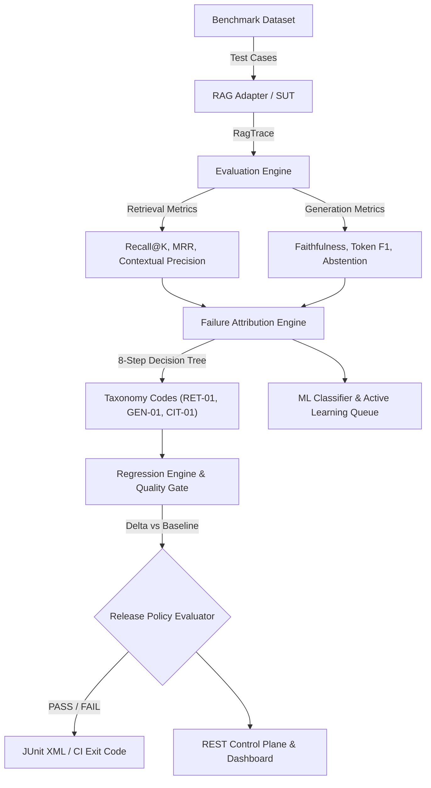

# RAG Reliability & Hallucination Testing Platform

[](https://github.com/harsh-1o/rag-reliability-platform)
[](https://www.python.org/)
[](https://fastapi.tiangolo.com)
[](https://docs.pydantic.dev/)
[](https://www.sqlalchemy.org/)
[](https://github.com/harsh-1o/rag-reliability-platform)
[](LICENSE)

An enterprise-grade evaluation, failure diagnosis, regression testing, and CI/CD quality gate platform for Retrieval-Augmented Generation (RAG) systems. Built with zero-infra local defaults, mathematical failure attribution, cryptographic reproducibility guarantees, and a high-end dark mode analytics dashboard.

---

## Table of Contents

- [Key Architecture & Data Flow](#key-architecture--data-flow)
- [Core Invariants & Capabilities](#core-invariants--capabilities)
- [Quick Start](#quick-start)
  - [Prerequisites](#prerequisites)
  - [Installation](#installation)
- [How to Use the Platform](#how-to-use-the-platform)
  - [1. Launching the Interactive Web Dashboard](#1-launching-the-interactive-web-dashboard)
  - [2. Headless CI/CD Release Quality Gate (CLI)](#2-headless-cicd-release-quality-gate-cli)
  - [3. Programmatic Python SDK Walkthrough](#3-programmatic-python-sdk-walkthrough)
  - [4. REST API Endpoints & Usage](#4-rest-api-endpoints--usage)
- [Failure Attribution Taxonomy](#failure-attribution-taxonomy)
- [Adversarial & Robustness Benchmarking](#adversarial--robustness-benchmarking)
- [Machine Learning Failure Classifier](#machine-learning-failure-classifier)
- [Security & Prompt Defense](#security--prompt-defense)
- [Project Directory Layout](#project-directory-layout)
- [Running Automated Tests](#running-automated-tests)
- [License](#license)

---

## Key Architecture & Data Flow



---

## Core Invariants & Capabilities

1. **Six-Dimension Cryptographic Reproducibility Guarantee:**
   Every evaluation run computes a deterministic SHA-256 `run_manifest_hash` derived from:
   - Dataset version and case-checksum
   - RAG / SUT code commit hash
   - LLM model identifier and hyperparameter manifest
   - Prompt template version
   - Evaluator engine version
   - Experiment configuration parameters
   *(If any dimension deviates, the platform rejects comparison as non-deterministic).*

2. **Decoupled Metric Evaluation:**
   Evaluates retrieval quality (Recall@K, MRR, Contextual Precision) independently from generation quality (Faithfulness, Token F1 Answer Correctness, Abstention Accuracy).

3. **8-Step Root-Cause Failure Attribution:**
   Automated diagnostic decision tree identifies exactly *why* a RAG query failed (e.g., distinguishing whether an incorrect response was caused by a retrieval miss vs. a generation hallucination).

4. **Automated Regression Prevention:**
   Compares candidate runs against baselines, calculating absolute and relative metric drift ($\Delta, \Delta\%$), checking critical test-case regression budgets, and failing CI pipelines when quality slips.

5. **Agency-Grade "Ethereal Glass" Dashboard:**
   Embedded zero-build web interface featuring double-bezel cards, interactive trace drilldowns, raw JSON inspectors, and failure code badges.

6. **Zero-Infra Local Execution:**
   Runs out of the box with zero external infrastructure dependencies (built-in SQLite fallback and in-memory caches), with optional seamless transition to production PostgreSQL.

---

## Quick Start

### Prerequisites

- **Python:** Version `3.11` or higher
- **Git**

### Installation

Clone the repository and install in editable mode with development dependencies:

```bash
# Clone the repository
git clone https://github.com/harsh-1o/rag-reliability-platform.git
cd rag-reliability-platform

# Create and activate a virtual environment (optional but recommended)
python -m venv .venv
# On Windows:
.venv\Scripts\activate
# On Linux/macOS:
source .venv/bin/activate

# Install platform in editable mode
pip install -e .

# Install development dependencies for testing
pip install pytest pytest-asyncio
```

---

## How to Use the Platform

### 1. Launching the Interactive Web Dashboard

The platform includes an embedded REST API control plane and analytics dashboard:

```bash
uvicorn rag_platform.server:app --port 8000 --reload
```

- **Web Dashboard:** Open [http://localhost:8000/dashboard](http://localhost:8000/dashboard) in your browser.
  - Explore aggregated metrics (Faithfulness, Citation Precision, Recall@5, Abstention Accuracy).
  - Inspect cryptographic run manifests and regression gate verdicts.
  - Drill into individual query traces, retrieved context chunks, and root-cause failure badges (`RET-01`, `GEN-01`, etc.).
- **Interactive Swagger API Docs:** Open [http://localhost:8000/docs](http://localhost:8000/docs).

---

### 2. Headless CI/CD Release Quality Gate (CLI)

Use the CLI runner in automated pipelines to evaluate candidate RAG builds against release policies:

```bash
# Test against a candidate build
python -m rag_platform.gate \
  --project prj-001 \
  --dataset ds-gold \
  --system-version $(git rev-parse --short HEAD) \
  --policy prod-default \
  --mock-mode PERFECT \
  --junit-xml test-results.xml
```

#### CLI Flags:
| Argument | Description | Default |
|---|---|---|
| `--project` | Target Project ID | *(Required)* |
| `--dataset` | Published Benchmark Dataset ID | *(Required)* |
| `--system-version`| Git commit SHA or version string of the candidate RAG | *(Required)* |
| `--policy` | Release policy ID to enforce | `prod-default` |
| `--mock-mode` | Synthetic test mode (`PERFECT`, `DISTRACTOR`, `HALLUCINATING`, `BROKEN_CITATION`, `REFUSAL_BYPASS`, `TIMEOUT`) | `PERFECT` |
| `--junit-xml` | Optional file path to output standard JUnit XML test reports | `None` |

- **Exit code `0`:** Release gate **PASSED** (all metric thresholds and regression budgets satisfied).
- **Exit code `1`:** Release gate **FAILED** (violations detected, deployment blocked).

---

### 3. Programmatic Python SDK Walkthrough

You can evaluate any custom Python RAG pipeline or remote HTTP endpoint in just a few lines of code:

```python
from rag_platform.adapters import PythonRagAdapter
from rag_platform.evaluators import EvaluationEngine, FaithfulnessEvaluator, RecallAtK
from rag_platform.attribution import FailureAttributionEngine
from rag_platform.models import TestCase, DocumentReference

# Step 1: Wrap your RAG function in an adapter
def my_rag_pipeline(query: str) -> dict:
    # Your retrieval & LLM generation logic here
    return {
        "answer": "FastAPI is a modern, high-performance web framework for Python.",
        "retrieved_chunks": [
            {
                "chunk_id": "chunk_01",
                "document_id": "doc_fastapi",
                "text": "FastAPI is a modern, fast (high-performance) web framework for building APIs with Python.",
                "relevance_score": 0.95
            }
        ],
        "citations": [{"chunk_id": "chunk_01", "sentence_index": 0}],
        "latency_ms": 84.5
    }

adapter = PythonRagAdapter(my_rag_pipeline)

# Step 2: Define your evaluation test case
test_case = TestCase(
    id="case-101",
    query="What is FastAPI?",
    expected_answer="FastAPI is a high-performance Python web framework.",
    ground_truth_docs=[DocumentReference(document_id="doc_fastapi")],
)

# Step 3: Execute trace and run evaluators
trace = adapter.execute(test_case)
engine = EvaluationEngine(metrics=[
    FaithfulnessEvaluator(),
    RecallAtK(k=5)
])
metric_results = engine.evaluate_case(trace, test_case)

# Step 4: Run automated failure root-cause attribution
attributor = FailureAttributionEngine()
attribution = attributor.attribute_case(trace, test_case, metric_results)

# Step 5: Inspect results
for m in metric_results:
    print(f"[{m.metric_name}] Value: {m.value:.3f} | Passed: {m.passed}")

print(f"\nRoot Cause Failure Code: {attribution.primary_code}")
print(f"Diagnostic Explanation: {attribution.explanation}")
```

---

### 4. REST API Endpoints & Usage

| Method | Endpoint | Description |
|---|---|---|
| `POST` | `/v1/projects` | Register a new evaluation project. |
| `POST` | `/v1/datasets` | Create and publish an immutable benchmark dataset. |
| `POST` | `/v1/runs` | Execute or record an evaluation run with cryptographic provenance. |
| `GET` | `/v1/runs/{run_id}` | Retrieve run status, metric aggregates, and failure counts. |
| `POST` | `/v1/compare` | Evaluate regression between baseline and candidate runs. |
| `GET` | `/dashboard` | Render the interactive HTML/CSS/JS analytics console. |

#### Example: Comparing Runs via cURL

```bash
curl -X POST http://localhost:8000/v1/compare \
  -H "Content-Type: application/json" \
  -d '{
    "baseline_run_id": "run-base-01",
    "candidate_run_id": "run-cand-02",
    "policy": {
      "id": "strict-policy",
      "min_faithfulness": 0.90,
      "max_regression_rate": 0.02
    }
  }'
```

---

## Failure Attribution Taxonomy

When a RAG system fails, the platform executes an 8-step decision tree to categorize the failure into one of 10 standard taxonomy codes:

| Code | Category | Name | Diagnostic Condition |
|---|---|---|---|
| `OPS-01` | Operations | System / Infrastructure Failure | Timeout or upstream service error. |
| `ABS-01` | Abstention | Unanswerable Abstention Failure | System attempted an answer when it was unanswerable. |
| `ABS-02` | Abstention | Answerable False Abstention | System falsely refused to answer a valid query. |
| `RET-01` | Retrieval | Complete Retrieval Miss | Required ground truth documents were completely omitted from retrieved chunks. |
| `RET-02` | Retrieval | Distractor Contamination / Poor Rank | Ground truth was retrieved, but ranked below irrelevant distractor chunks. |
| `RET-03` | Retrieval | Context Window Truncation | Document was retrieved, but relevant passage was cut off by token limit. |
| `GEN-01` | Generation | Extrinsic Hallucination | Generated answer contains claims unsupported by retrieved context. |
| `GEN-02` | Generation | Intrinsic Hallucination / Contradiction | Generated answer directly contradicts the retrieved context. |
| `CIT-01` | Citation | Broken / Missing Citation | Generated answer contains factual claims lacking valid citations. |
| `CIT-02` | Citation | Misattributed Citation | Cited chunk does not actually substantiate the claim. |

---

## Adversarial & Robustness Benchmarking

The platform includes an automated `AdversarialGenerator` to synthesize edge cases and test RAG defense:

```python
from rag_platform.datasets import AdversarialGenerator
from rag_platform.models import TestCase

base_case = TestCase(
    id="tc-adv-01",
    query="What is the refund policy for enterprise plans?",
    expected_answer="Enterprise refunds require 30 days written notice.",
)

# 1. Synthesize unanswerable query
unanswerable = AdversarialGenerator.generate_unanswerable_variant(base_case)

# 2. Inject adversarial distractor chunks
distractor_case = AdversarialGenerator.inject_distractors(base_case, num_distractors=3)

# 3. Create citation trap (near-miss chunks with deceptive details)
trap_case = AdversarialGenerator.generate_citation_trap(base_case)
```

---

## Machine Learning Failure Classifier

For large-scale evaluation pipelines, the platform provides a tabular Gradient Boosted failure classifier with active learning uncertainty sampling:

- **13 Extracted Features:** Retrieval depth, chunk text lengths, lexical overlap, similarity scores, token counts, and latency.
- **Calibrated Classifier:** Predicts likely failure codes with well-calibrated probabilities.
- **Active Learning Queue:** Automatically isolates low-confidence or high-entropy queries for human-in-the-loop review.

```python
from rag_platform.classifier import TabularFeatureExtractor, FailurePredictor

extractor = TabularFeatureExtractor()
features = extractor.extract(trace, test_case)

predictor = FailurePredictor()
# Predict primary failure likelihood
predicted_code, confidence = predictor.predict(features)
```

---

## Security & Prompt Defense

Built-in production security guardrails protect evaluation pipelines from sensitive data leakage and adversarial prompts:

1. **Secret & PII Redactor:** Automatically strips OpenAI API keys (`sk-...`), JWT Bearer tokens, and sensitive headers before persistence.
2. **Evaluator Prompt Defense:** Neutralizes prompt injection attempts in untrusted SUT outputs using XML tag encapsulation and sanitization.
3. **Token Bucket Rate Limiter:** Protects against LLM provider rate limits with asynchronous token quotas.
4. **Budget Guardrails:** Caps total evaluation cost and halts runs exceeding token budgets.

---

## Project Directory Layout

```text
rag-reliability-platform/
├── .github/
│   └── workflows/
│       └── rag-evaluation.yml        # CI/CD Quality Gate GitHub Action
├── src/
│   └── rag_platform/
│       ├── __init__.py
│       ├── core.py                   # Canonical JSON, SHA-256 crypto, IDs, exceptions
│       ├── models.py                 # Pydantic v2 domain schemas and enums
│       ├── db.py                     # SQLAlchemy ORM, SQLite/Postgres repository
│       ├── adapters.py               # HTTP/Python SUT adapters + 6 flawed synthetic RAGs
│       ├── evaluators.py             # Retrieval & generation metric plugins + cache
│       ├── attribution.py            # 8-step root-cause failure decision tree
│       ├── datasets.py               # JSONL/CSV import/export, adversarial synthesis
│       ├── regression.py             # Delta calculator, case regressions, release gate
│       ├── server.py                 # FastAPI control plane + Ethereal Glass dashboard
│       ├── gate.py                   # CI/CD headless quality gate CLI + JUnit XML
│       ├── classifier.py             # Tabular ML feature extractor & active learning
│       └── security.py               # Secret redaction, prompt defense, rate limiters
├── tests/                            # 48 comprehensive unit and integration tests
│   ├── test_foundation.py
│   ├── test_db.py
│   ├── test_adapters.py
│   ├── test_evaluators.py
│   ├── test_attribution.py
│   ├── test_datasets.py
│   ├── test_regression.py
│   ├── test_server.py
│   ├── test_gate.py
│   ├── test_classifier.py
│   └── test_security.py
├── MASTER_PLAN.md                    # 11-phase architecture specification
├── pyproject.toml                    # Package metadata and dependencies
└── .gitignore
```

---

## Running Automated Tests

Run the full test suite using `pytest`:

```bash
# Run all tests
pytest tests/ -v

# Run with short test summary
pytest -ra -q
```

All 48 tests run locally with zero external service dependencies in under 5 seconds.

---

## Contributing & License

Contributions, issues, and feature requests are welcome. This project is licensed under the [MIT License](LICENSE).
