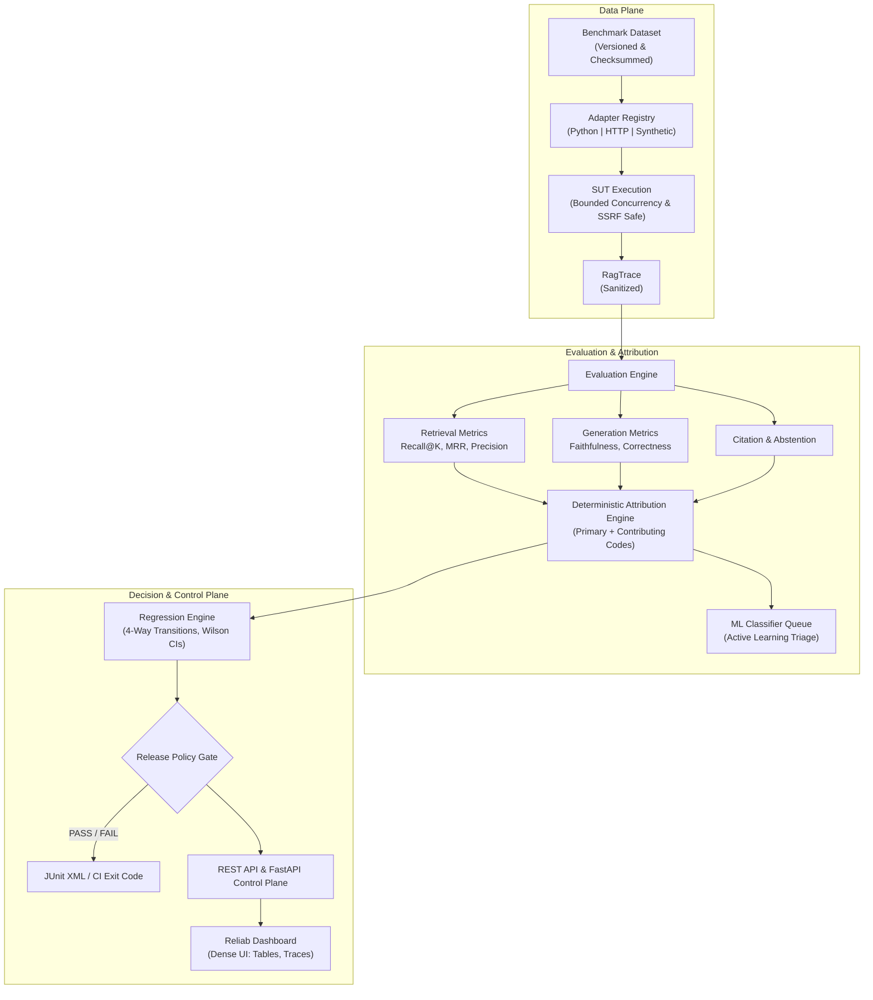

# Platform Architecture

Reliab provides modular developer infrastructure for evaluating, diagnosing, and gating Retrieval-Augmented Generation (RAG) and LLM systems.

---

## 1. High-Level Architecture

Reliab strictly separates the execution data plane, metric evaluation engine, failure attribution subsystem, regression analysis engine, and control plane.



---

## 2. Core Subsystems

### Data Plane
- **Dataset Registry**: Stores versioned, immutable benchmark datasets. Each version maintains a SHA-256 checksum across all test cases to guarantee evaluation integrity.
- **Adapter Registry**: Connects to the System Under Test (SUT) via in-process Python interfaces, synthetic simulation modes, or external HTTP endpoints.
- **SSRF-Safe Transport**: Restricts HTTP outbound traffic with pre-flight DNS resolution and IP socket-pinning against private or cloud metadata address ranges.
- **Secret Sanitizer**: Recursively redacts JWTs, bearer tokens, API keys, and connection strings from traces prior to persistence.

### Evaluation & Attribution Plane
- **Evaluation Engine**: Executes asynchronous, parallel evaluators for retrieval quality, claim-level faithfulness, answer correctness, citation alignment, and abstention compliance.
- **Metric Applicability**: Evaluators decouple conditional scoring from default values; missing preconditions yield `NOT_APPLICABLE` (`score=None`) rather than arbitrary penalties.
- **Deterministic Attribution Engine**: Maps metric failures to canonical diagnostic codes (`RET-01`, `GEN-01`, `CIT-02`, etc.) with supporting evidence extracted from traces.
- **Active Learning Classifier**: Auxiliary scikit-learn classifier providing secondary confidence scoring and triage prioritization for unclassified traces.

### Decision & Control Plane
- **Regression Engine**: Evaluates candidate runs against a baseline run using four-way per-case transition tracking (`NEW_FAILURE`, `RECOVERED`, `UNCHANGED_PASS`, `UNCHANGED_FAIL`).
- **Release Policy Gate**: Computes pass/fail verdicts against configurable statistical thresholds and regression budgets, producing standard JUnit XML reports and process exit codes.
- **FastAPI Control Plane**: Powers the REST API, session management, authentication middleware, and background task dispatch.
- **Web Dashboard**: Server-rendered, responsive console for inspecting runs, traces, metrics, and failure attributions.

---

## 3. Evaluation Pipeline Execution Flow

For every test case in an evaluation run:

```text
Test Case + Run Configuration
       ↓
  RAG Adapter Execution (Async Semaphore Concurrency & SSRF Transport)
       ↓
  Recursive Secret Sanitization
       ↓
  Metric Evaluation (Parallel Async Tasks)
   ├── Retrieval Evaluation (Recall@K, MRR, Contextual Precision)
   ├── Claim Extraction & Clause Decomposition
   ├── Lexical Claim Grounding & Verification
   ├── Fact-Anchored Answer Correctness
   ├── Citation Validation
   └── Abstention & Refusal Verification
       ↓
  Failure Attribution (Primary code, Contributing codes, Evidence)
       ↓
  Database Persistence (Alembic schema, Normalized records)
       ↓
  Aggregate Run Metrics (Wilson Score Intervals, Sample Size Warnings)
```

---

## 4. Standalone Durable Worker Architecture

Asynchronous evaluation runs (`POST /v1/runs` with `async_exec=true`) are processed by durable worker processes:

- **Atomic Lease Claiming**: Workers acquire queued runs via optimistic database lease locking with configurable timeouts (`lock_timeout_seconds`).
- **Heartbeat Maintenance**: Active workers periodically renew their lease timestamp to signal healthy execution.
- **Stale Runner Recovery**: Abandoned or crashed jobs from ungraceful worker termination are automatically reclaimed and recovered.
- **Notification-Driven Wakeup**: Supports PostgreSQL `LISTEN/NOTIFY` with thread-safe `asyncio` event dispatch, falling back to adaptive backoff polling for SQLite.

---

## 5. Architectural Tenets

1. **Deterministic Rules as Source of Truth**: Attribution and quality gates rely on explicit, explainable programmatic logic rather than black-box LLM judgements.
2. **Fail-Closed by Design**: Quality gates exit with code `1` whenever violations occur, blocking regressions before code reaches staging or production.
3. **Decoupled Applicability**: Metrics distinguish between genuine failures and irrelevant checks through explicit `NOT_APPLICABLE` statuses.
4. **Zero Unsanitized Traces**: Sensitive credentials and tokens are scrubbed in-memory before database write operations.
