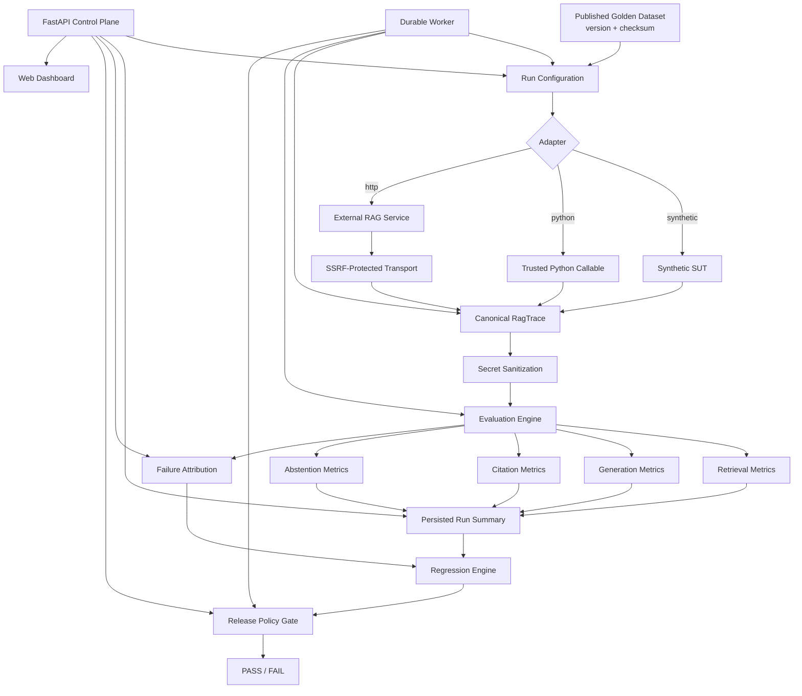

# Platform Architecture

Reliab evaluates existing RAG/LLM systems and turns benchmark evidence into diagnostics and release-gate decisions.

## High-level architecture



## Execution plane

```text
TestCase → RunConfig → Adapter → SUT → RagTrace → sanitization
```

The adapter is the integration boundary; the evaluator consumes the normalized trace rather than provider-specific response formats.

## Evaluation plane

```text
RagTrace
  ├─ retrieval
  ├─ generation/claims
  ├─ citations
  └─ abstention
       ↓
MetricResult[]
       ↓
aggregate summary
```

Conditional metrics return `NOT_APPLICABLE`/`score=None` when their preconditions are absent instead of manufacturing a zero.

## Diagnostic plane

The deterministic attribution engine maps observed metric/trace conditions to retrieval, generation, citation, abstention, and operational diagnostic codes. Attribution is a heuristic diagnostic hypothesis, not causal proof or a calibrated probability.

## Decision plane

The regression engine compares baseline and candidate cases. The release gate applies coverage, quality floors, regression budgets, latency, and cost policy.

Case membership is explicit:

```text
baseline IDs - candidate IDs = CANDIDATE_MISSING
candidate IDs - baseline IDs = BASELINE_MISSING
```

## Durable workers

```text
POST /v1/runs
   ↓
persist → QUEUED
   ↓
worker lease claim
   ↓
heartbeat
   ↓
execute cases
   ↓
persist summary + gate
   ↓
COMPLETED / FAILED / CANCELLED
```

Lease IDs and heartbeat timestamps prevent obsolete workers from overwriting recovered runs. PostgreSQL supports notification-driven wakeups; SQLite uses adaptive polling.

## Persistence and integrity

The database contains projects, datasets/cases, runs, traces, metrics, failures, API keys, sessions, and cache entries.

Run creation checks dataset existence/publication, project ownership, dataset version/checksum, and provenance manifest integrity.

Alembic owns persistent schema changes.

## Security boundaries

```text
API caller
  ↓
authentication + project authorization
  ↓
run configuration
  ├─ Python → trusted registry
  └─ HTTP → SSRF-safe transport
  ↓
sanitized RagTrace
  ↓
evaluation/persistence
```

Retrieved documents are also treated as untrusted content for prompt-injection defenses.

## Control plane

FastAPI provides authentication, projects, datasets, runs, traces, failures, comparison, maintenance, and dashboard endpoints. The dashboard is a static JavaScript client; backend-controlled values are escaped before HTML insertion.

## Design principles

1. Reliab evaluates an external SUT; it is not the model host.
2. Normalized traces are the evaluation boundary.
3. Deterministic metrics are the release source of truth.
4. Diagnostics are explicitly heuristic.
5. Coverage is a release dimension.
6. Published benchmark data is immutable.
7. Provenance is integrity checked.
8. Operational failures are separated from quality failures.
